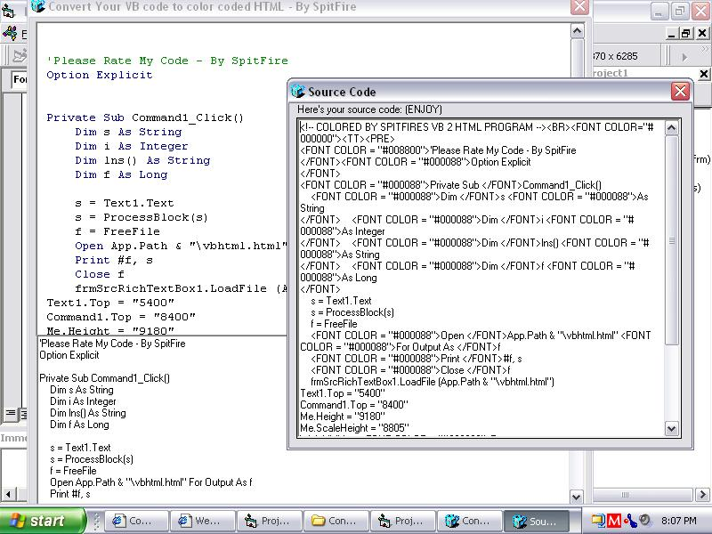



## Convert Your VB code to color coded HTML \(Updated finnally\)

### Description

Well its been awhile since i released "Convert Your VB code to color coded HTML" on 10/13/2002, and I never actually started listening to peoples feedback untill today while i was browsing threw my 30 some submissions... Since people sayed i should add this, you can now finnally few the source code :) Please rate and enjoy ;)
 
### More Info
 
'Please rate and such

             |
---                |---
**Submitted On**   |2003-05-22 20:08:06
**By**             |[Jesse Seidel \(Dr\. Fire\)](https://github.com/Planet-Source-Code/PSCIndex/blob/master/ByAuthor/jesse-seidel-dr-fire.md)
**Level**          |Advanced
**User Rating**    |5.0 (10 globes from 2 users)
**Compatibility**  |VB 6\.0
**Category**       |[Internet/ HTML](https://github.com/Planet-Source-Code/PSCIndex/blob/master/ByCategory/internet-html__1-34.md)
**World**          |[Visual Basic](https://github.com/Planet-Source-Code/PSCIndex/blob/master/ByWorld/visual-basic.md)
**Archive File**   |[Convert\_Yo1591235222003\.zip](https://github.com/Planet-Source-Code/jesse-seidel-dr-fire-convert-your-vb-code-to-color-coded-html-updated-finnally__1-45658/archive/master.zip)

